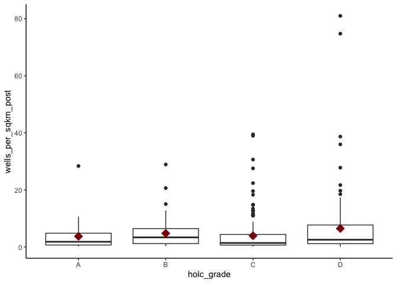

# Cities

### Table. Cities with ≥ 10 wells w/in 100 m

- 33 cities from 13 states with ≥ 10 well within 100 m of HOLC-graded neighborhoods
- 13 additional cities with wells within 3 km


```r
holc_exp %>%
  filter(city_wells_100m_all >= 10) %>%
  as_tibble() %>%
  distinct(city_state, city_wells_0km_all, city_wells_100m_all, 
           city_wells_1km_all) %>%
  arrange(desc(city_wells_100m_all))
```

```
## # A tibble: 33 x 4
##    city_state         city_wells_100m_all city_wells_1km_all city_wells_0km_all
##    <chr>                            <dbl>              <dbl>              <dbl>
##  1 Los Angeles - CA                  6618              11503               5311
##  2 Cleveland - OH                    1193               1925                972
##  3 Oklahoma City - OK                1167               1612                846
##  4 Erie - PA                          996               1208                396
##  5 San Antonio - TX                   886                888                849
##  6 Canton - OH                        295                514                209
##  7 Fort Worth - TX                    264                708                185
##  8 Akron - OH                         245                752                187
##  9 Saginaw - MI                       225                372                174
## 10 Lima - OH                          176               1745                119
## # … with 23 more rows
```

## Census data

### Table. Cities with ≥ 10 wells w/in 100 m AND census tracts data

- 15 cities with ≥ 10 wells within 1 km of HOLC-graded neighborhoods *and* census tracts data
- 5 additional cities with ≥ 10 wells within 3 km


```
## # A tibble: 10 x 2
##    city_state                 city_wells_1km_all
##    <chr>                                   <dbl>
##  1 Los Angeles - CA                        11503
##  2 Cleveland - OH                           1925
##  3 Akron - OH                                752
##  4 Detroit - MI                              416
##  5 Greater Kansas City - MO                  368
##  6 New York City - NY                        217
##  7 Pittsburgh - PA                           191
##  8 Indianapolis - IN                         103
##  9 Buffalo - NY                               61
## 10 Lower Westchester Co. - NY                 22
```

### Table. Cities with ≥ 10 wells w/in 100 m AND census tracts data, demographics

Make this a supplemental table


```
## `summarise()` regrouping output by 'city_state' (override with `.groups` argument)
```

```
## # A tibble: 41 x 5
## # Groups:   city_state [10]
##    city_state     holc_grade total_pop wells_1km_preholc wells_1km_postholc
##    <chr>          <chr>          <int>             <dbl>              <dbl>
##  1 Akron - OH     A              28231                 0                 97
##  2 Akron - OH     B              48210                10                181
##  3 Akron - OH     C              57070                 1                252
##  4 Akron - OH     D              47111                 7                186
##  5 Buffalo - NY   A              21820                 3                  0
##  6 Buffalo - NY   B              36344                 2                  0
##  7 Buffalo - NY   C               6532                 1                  8
##  8 Buffalo - NY   D              46890                 0                  6
##  9 Cleveland - OH A             100977                29                 65
## 10 Cleveland - OH B             200270                62                 71
## # … with 31 more rows
```

# Wells


```
## [1] "n wells within 1 km of HOLC neighborhoods in full dataset:"
```

```
## [1] 64479
```

```
## [1] "wells in neighborhoods:"
```

```
## [1] 9969
```

```
## [1] "wells from 0 m to 100 m from HOLC neighborhoods:"
```

```
## [1] 4598
```

```
## [1] "wells from 0 m to 1 km from HOLC neighborhoods:"
```

```
## [1] 54510
```


# Neighborhoods

**Table. Area of neighborhoods by HOLC grade (km^2), all neighborhoods**


```
## `summarise()` ungrouping output (override with `.groups` argument)
```

```
## # A tibble: 4 x 7
##   holc_grade area_total area_mean area_median area_sd area_min area_max
##   <chr>           <dbl>     <dbl>       <dbl>   <dbl>    <dbl>    <dbl>
## 1 A                395.      1.41        0.85    1.71     0.02     14.6
## 2 B                769.      1.31        0.83    1.4      0.03     12.5
## 3 C               1951.      1.93        1.2     3.4      0.05     66.8
## 4 D               1104.      1.79        0.96    2.53     0.03     26.9
```

**Table. Area of neighborhoods by HOLC grade (km^2), exposed neighborhoods**


```
## `summarise()` ungrouping output (override with `.groups` argument)
```

```
## # A tibble: 4 x 6
##   holc_grade area_mean area_median area_sd area_min area_max
##   <chr>          <dbl>       <dbl>   <dbl>    <dbl>    <dbl>
## 1 A               1.83        1.22    1.76     0.28     9.1 
## 2 B               1.73        1.28    1.63     0.15     7.68
## 3 C               2.55        1.66    2.98     0.09    22.6 
## 4 D               2.56        1.33    3.1      0.08    14.5
```

**Quantiles of neighborhood area, all neighborhoods**


```
## Warning in system2("/usr/bin/otool", c("-L", shQuote(DSO)), stdout = TRUE):
## running command ''/usr/bin/otool' -L '/Library/Frameworks/R.framework/Resources/
## modules/R_de.so'' had status 1
```

**Quantiles of neighborhood area, all neighborhoods**


```
##         0%        25%        50%        75%       100% 
##  0.0775225  0.7886793  1.3999435  2.8726211 22.5530093
```


# Exposure normalized by area

## Wells within 0 m, i.e., within neighborhood

### All

**Table. Wells per km^2 among all neighborhoods**


```
## `summarise()` ungrouping output (override with `.groups` argument)
```

```
## # A tibble: 4 x 6
##   holc_grade  mean median    sd   min   max
##   <chr>      <dbl>  <dbl> <dbl> <dbl> <dbl>
## 1 A           1.49      0  5.00     0  34.7
## 2 B           1.51      0  5.69     0  68.7
## 3 C           2.23      0 13.1      0 221. 
## 4 D           3.10      0 14.7      0 191.
```

**Table. Pre-HOLC wells per km^2 among neighborhoods with wells**


```
## `summarise()` ungrouping output (override with `.groups` argument)
```

```
## # A tibble: 4 x 6
##   holc_grade  mean median    sd    min   max
##   <chr>      <dbl>  <dbl> <dbl>  <dbl> <dbl>
## 1 A           6.83   2.62  8.91 0.137   34.7
## 2 B           7.64   2.71 10.9  0.146   68.7
## 3 C           9.17   2.05 25.5  0.0267 221. 
## 4 D          12.2    2.92 27.2  0.0814 191.
```

**Figure Pre-HOLC wells per km^2 among neighborhoods with wells**

<!-- -->


```
## `summarise()` ungrouping output (override with `.groups` argument)
```

```
## # A tibble: 4 x 6
##   holc_grade  mean median    sd   min   max
##   <chr>      <dbl>  <dbl> <dbl> <dbl> <dbl>
## 1 A           1.49      0  5.00     0  34.7
## 2 B           1.51      0  5.69     0  68.7
## 3 C           2.23      0 13.1      0 221. 
## 4 D           3.10      0 14.7      0 191.
```

**ANOVA**


```
## Analysis of Variance Table
## 
## Response: (wells_0km_all/area_sqkm)
##                        Df Sum Sq Mean Sq F value Pr(>F)
## as.factor(holc_grade)   3   1978  659.35  1.2959  0.275
## Residuals             575 292568  508.81
```


### Pre-appraisal

**Table. Pre-HOLC wells per km^2 among all neighborhoods**


```
## `summarise()` ungrouping output (override with `.groups` argument)
```

```
## # A tibble: 4 x 6
##   holc_grade  mean median    sd   min   max
##   <chr>      <dbl>  <dbl> <dbl> <dbl> <dbl>
## 1 A          0.139      0 0.866     0  12.1
## 2 B          0.104      0 0.645     0  12.3
## 3 C          0.182      0 2.72      0  84.4
## 4 D          1.12       0 6.85      0  84.8
```

**Table. Pre-HOLC wells per km^2 among neighborhoods with wells**


```
## `summarise()` ungrouping output (override with `.groups` argument)
```

```
## # A tibble: 4 x 6
##   holc_grade  mean median    sd    min   max
##   <chr>      <dbl>  <dbl> <dbl>  <dbl> <dbl>
## 1 A           2.05  1.28   2.74 0.110   12.1
## 2 B           1.75  1.38   2.06 0.146   12.3
## 3 C           2.88  0.818 10.5  0.0443  84.4
## 4 D          11.9   1.47  19.4  0.0740  84.8
```

**Figure Pre-HOLC wells per km^2 among neighborhoods with wells**

<!-- -->


```
## `summarise()` ungrouping output (override with `.groups` argument)
```

```
## # A tibble: 4 x 6
##   holc_grade  mean median    sd   min   max
##   <chr>      <dbl>  <dbl> <dbl> <dbl> <dbl>
## 1 A          0.139      0 0.866     0  12.1
## 2 B          0.104      0 0.645     0  12.3
## 3 C          0.182      0 2.72      0  84.4
## 4 D          1.12       0 6.85      0  84.8
```

**ANOVA**


```
## Analysis of Variance Table
## 
## Response: (wells_0km_all_preholc/area_sqkm)
##                        Df  Sum Sq Mean Sq F value    Pr(>F)    
## as.factor(holc_grade)   3  3543.3 1181.10  7.0736 0.0001643 ***
## Residuals             172 28719.2  166.97                      
## ---
## Signif. codes:  0 '***' 0.001 '**' 0.01 '*' 0.05 '.' 0.1 ' ' 1
```

### Post-appraisal

**Table. Post-HOLC wells per km^2 among all neighborhoods**


```
## `summarise()` ungrouping output (override with `.groups` argument)
```

```
## # A tibble: 4 x 6
##   holc_grade  mean median    sd   min   max
##   <chr>      <dbl>  <dbl> <dbl> <dbl> <dbl>
## 1 A          0.479      0  2.22     0  28.4
## 2 B          0.445      0  2.14     0  28.9
## 3 C          0.594      0  2.89     0  39.5
## 4 D          1.39       0  5.78     0  81.0
```

**Table. Post-HOLC wells per km^2 among neighborhoods with wells**


```
## `summarise()` ungrouping output (override with `.groups` argument)
```

```
## # A tibble: 4 x 6
##   holc_grade  mean median    sd    min   max
##   <chr>      <dbl>  <dbl> <dbl>  <dbl> <dbl>
## 1 A           3.73   1.82  5.17 0.153   28.4
## 2 B           4.76   3.35  5.37 0.234   28.9
## 3 C           3.92   1.39  6.51 0.103   39.5
## 4 D           6.48   2.52 11.1  0.0826  81.0
```

**Figure. Post-HOLC wells per km^2 among neighborhoods with wells**

<!-- -->


```
## Analysis of Variance Table
## 
## Response: (wells_0km_all_postholc/area_sqkm)
##                         Df Sum Sq Mean Sq F value    Pr(>F)    
## as.factor(holc_grade)    4    350  87.436  6.5929 2.826e-05 ***
## Residuals             2492  33049  13.262                      
## ---
## Signif. codes:  0 '***' 0.001 '**' 0.01 '*' 0.05 '.' 0.1 ' ' 1
```

## Wells within 100 m, i.e., within neighborhood

### All

**Table. Wells per km^2 among all neighborhoods**


```
## `summarise()` ungrouping output (override with `.groups` argument)
```

```
## # A tibble: 4 x 6
##   holc_grade  mean median    sd   min   max
##   <chr>      <dbl>  <dbl> <dbl> <dbl> <dbl>
## 1 A           2.94      0  12.3     0  162.
## 2 B           4.59      0  44.0     0 1046.
## 3 C           3.94      0  25.8     0  630.
## 4 D           4.47      0  19.2     0  271.
```

**Table. Pre-HOLC wells per km^2 among neighborhoods with wells**


```
## `summarise()` ungrouping output (override with `.groups` argument)
```

```
## # A tibble: 4 x 6
##   holc_grade  mean median    sd    min   max
##   <chr>      <dbl>  <dbl> <dbl>  <dbl> <dbl>
## 1 A           10.2   2.63  21.3 0.137   162.
## 2 B           16.5   3.65  82.4 0.163  1046.
## 3 C           13.4   2.89  46.1 0.0267  630.
## 4 D           14.3   2.96  32.4 0.0814  271.
```

**Figure Pre-HOLC wells per km^2 among neighborhoods with wells**

<!-- -->


```
## `summarise()` ungrouping output (override with `.groups` argument)
```

```
## # A tibble: 4 x 6
##   holc_grade  mean median    sd   min   max
##   <chr>      <dbl>  <dbl> <dbl> <dbl> <dbl>
## 1 A           2.94      0  12.3     0  162.
## 2 B           4.59      0  44.0     0 1046.
## 3 C           3.94      0  25.8     0  630.
## 4 D           4.47      0  19.2     0  271.
```

**ANOVA**


```
## Analysis of Variance Table
## 
## Response: (wells_100m_all/area_sqkm)
##                        Df  Sum Sq Mean Sq F value Pr(>F)
## as.factor(holc_grade)   3    2352  784.06  0.2901 0.8326
## Residuals             731 1975849 2702.94
```


### Pre-appraisal

**Table. Pre-HOLC wells per km^2 among all neighborhoods**


```
## `summarise()` ungrouping output (override with `.groups` argument)
```

```
## # A tibble: 4 x 6
##   holc_grade  mean median    sd   min   max
##   <chr>      <dbl>  <dbl> <dbl> <dbl> <dbl>
## 1 A          0.187      0  1.25     0  18.5
## 2 B          0.200      0  1.19     0  18.4
## 3 C          0.254      0  2.87     0  86.6
## 4 D          1.62       0  9.51     0 107.
```

**Table. Pre-HOLC wells per km^2 among neighborhoods with wells**


```
## `summarise()` ungrouping output (override with `.groups` argument)
```

```
## # A tibble: 4 x 6
##   holc_grade  mean median    sd    min   max
##   <chr>      <dbl>  <dbl> <dbl>  <dbl> <dbl>
## 1 A           2.49   1.29  3.95 0.110   18.5
## 2 B           2.56   1.50  3.50 0.146   18.4
## 3 C           2.82   1.08  9.23 0.0443  86.6
## 4 D          14.1    1.46 24.9  0.0740 107.
```

**Figure Pre-HOLC wells per km^2 among neighborhoods with wells**

<!-- -->


```
## `summarise()` ungrouping output (override with `.groups` argument)
```

```
## # A tibble: 4 x 6
##   holc_grade  mean median    sd   min   max
##   <chr>      <dbl>  <dbl> <dbl> <dbl> <dbl>
## 1 A          0.187      0  1.25     0  18.5
## 2 B          0.200      0  1.19     0  18.4
## 3 C          0.254      0  2.87     0  86.6
## 4 D          1.62       0  9.51     0 107.
```

**ANOVA**


```
## Analysis of Variance Table
## 
## Response: (wells_100m_all_preholc/area_sqkm)
##                        Df Sum Sq Mean Sq F value    Pr(>F)    
## as.factor(holc_grade)   3   6351 2116.99  9.1949 9.187e-06 ***
## Residuals             225  51803  230.23                      
## ---
## Signif. codes:  0 '***' 0.001 '**' 0.01 '*' 0.05 '.' 0.1 ' ' 1
```

### Post-appraisal

**Table. Post-HOLC wells per km^2 among all neighborhoods**


```
## `summarise()` ungrouping output (override with `.groups` argument)
```

```
## # A tibble: 4 x 6
##   holc_grade  mean median    sd   min   max
##   <chr>      <dbl>  <dbl> <dbl> <dbl> <dbl>
## 1 A          0.787      0  3.19     0  32.2
## 2 B          1.35       0 10.4      0 234. 
## 3 C          1.39       0 11.6      0 339. 
## 4 D          2.21       0  8.43     0 140.
```

**Table. Post-HOLC wells per km^2 among neighborhoods with wells**


```
## `summarise()` ungrouping output (override with `.groups` argument)
```

```
## # A tibble: 4 x 6
##   holc_grade  mean median    sd    min   max
##   <chr>      <dbl>  <dbl> <dbl>  <dbl> <dbl>
## 1 A           4.41   1.96  6.47 0.153   32.2
## 2 B           7.95   2.89 24.2  0.234  234. 
## 3 C           7.22   1.91 25.7  0.100  339. 
## 4 D           8.17   3.41 14.6  0.0826 140.
```

**Figure. Post-HOLC wells per km^2 among neighborhoods with wells**

<!-- -->

**ANOVA**


```
## Analysis of Variance Table
## 
## Response: (wells_100m_all_postholc/area_sqkm)
##                        Df Sum Sq Mean Sq F value Pr(>F)
## as.factor(holc_grade)   3    584  194.78  0.4418 0.7232
## Residuals             508 223954  440.85
```

## Wells within 1 km of neighborhood

### Pre-appraisal

**Table. Pre-HOLC wells per km^2 among all neighborhoods**


```
## `summarise()` ungrouping output (override with `.groups` argument)
```

```
## # A tibble: 4 x 6
##   holc_grade  mean median    sd   min   max
##   <chr>      <dbl>  <dbl> <dbl> <dbl> <dbl>
## 1 A           2.11      0  6.83     0  56.3
## 2 B           2.22      0 11.2      0 170. 
## 3 C           1.63      0 10.5      0 245. 
## 4 D           7.64      0 39.9      0 388.
```

**Table. Pre-HOLC wells per km^2 among neighborhoods with wells**


```
## `summarise()` ungrouping output (override with `.groups` argument)
```

```
## # A tibble: 4 x 6
##   holc_grade  mean median    sd    min   max
##   <chr>      <dbl>  <dbl> <dbl>  <dbl> <dbl>
## 1 A           9.07   4.99  11.8 0.159   56.3
## 2 B          10.6    4.05  22.6 0.175  170. 
## 3 C           7.65   2.63  21.7 0.0443 245. 
## 4 D          32.3    2.80  77.2 0.138  388.
```

**Figure Pre-HOLC wells per km^2 among neighborhoods with wells**

<!-- -->

**ANOVA**


```
## Analysis of Variance Table
## 
## Response: (wells_1km_all_preholc/area_sqkm)
##                        Df  Sum Sq Mean Sq F value    Pr(>F)    
## as.factor(holc_grade)   3   60059 20019.5  10.547 9.434e-07 ***
## Residuals             546 1036417  1898.2                      
## ---
## Signif. codes:  0 '***' 0.001 '**' 0.01 '*' 0.05 '.' 0.1 ' ' 1
```

### Post-appraisal

**Table. Post-HOLC wells per km^2 among all neighborhoods**


```
## `summarise()` ungrouping output (override with `.groups` argument)
```

```
## # A tibble: 4 x 6
##   holc_grade  mean median    sd   min   max
##   <chr>      <dbl>  <dbl> <dbl> <dbl> <dbl>
## 1 A          14.5       0  80.4     0 1236.
## 2 B          12.7       0  38.9     0  337.
## 3 C           8.80      0  35.0     0  536.
## 4 D          13.3       0  46.5     0  822.
```

**Table. Post-HOLC wells per km^2 among neighborhoods with wells**


```
## `summarise()` ungrouping output (override with `.groups` argument)
```

```
## # A tibble: 4 x 6
##   holc_grade  mean median    sd    min   max
##   <chr>      <dbl>  <dbl> <dbl>  <dbl> <dbl>
## 1 A           30.5   5.60 115.  0.153  1236.
## 2 B           28.9   6.35  54.4 0.148   337.
## 3 C           20.9   5.46  51.6 0.0534  536.
## 4 D           26.9   7.73  63.5 0.157   822.
```

**Figure. Post-HOLC wells per km^2 among neighborhoods with wells**

<!-- -->

**ANOVA**


```
## Analysis of Variance Table
## 
## Response: (wells_1km_all_preholc/area_sqkm)
##                         Df  Sum Sq Mean Sq F value    Pr(>F)    
## as.factor(holc_grade)    3   29445  9815.1  9.7535 2.354e-06 ***
## Residuals             1118 1125051  1006.3                      
## ---
## Signif. codes:  0 '***' 0.001 '**' 0.01 '*' 0.05 '.' 0.1 ' ' 1
```


# Exposure normalized by population

*Note: restricted to the 15 cities with wells and census data*

## 0 km, i.e., within neighborhood

### All

**Table. Pre-HOLC wells per 1,000 people among all neighborhoods**


```
## `summarise()` ungrouping output (override with `.groups` argument)
```

```
## # A tibble: 4 x 6
##   holc_grade  mean median    sd   min   max
##   <chr>      <dbl>  <dbl> <dbl> <dbl> <dbl>
## 1 A          0.406      0  1.27     0  7.52
## 2 B          0.446      0  1.78     0 16.0 
## 3 C          0.683      0  4.63     0 86.4 
## 4 D          0.913      0  6.21     0 66.4
```

**Table. Pre-HOLC wells per 1,000 people among neighborhoods with wells**


```
## `summarise()` ungrouping output (override with `.groups` argument)
```

```
## # A tibble: 4 x 6
##   holc_grade  mean median    sd    min   max
##   <chr>      <dbl>  <dbl> <dbl>  <dbl> <dbl>
## 1 A           2.03  0.975  2.21 0.134   7.52
## 2 B           2.43  0.690  3.56 0.0890 16.0 
## 3 C           3.80  0.706 10.4  0.0847 86.4 
## 4 D           5.89  0.477 14.9  0.117  66.4
```

**Figure Pre-HOLC wells per 1,0000 people among neighborhoods with wells**

<!-- -->

**ANOVA**


```
## Analysis of Variance Table
## 
## Response: (wells_1km_all/pop40_w)
##                        Df  Sum Sq   Mean Sq F value Pr(>F)
## as.factor(holc_grade)   3 0.01060 0.0035321  1.8392 0.1406
## Residuals             246 0.47243 0.0019205
```

### Pre-appraisal

**Table. Pre-HOLC wells per 1,000 people among all neighborhoods**


```
## `summarise()` ungrouping output (override with `.groups` argument)
```

```
## # A tibble: 4 x 6
##   holc_grade   mean median    sd   min   max
##   <chr>       <dbl>  <dbl> <dbl> <dbl> <dbl>
## 1 A          0.0972      0 0.921     0 11.0 
## 2 B          0.0216      0 0.163     0  2.12
## 3 C          0.0393      0 0.301     0  5.74
## 4 D          0.191       0 2.46      0 43.7
```

**Table. Pre-HOLC wells per 1,000 people among neighborhoods with wells**


```
## `summarise()` ungrouping output (override with `.groups` argument)
```

```
## # A tibble: 4 x 6
##   holc_grade  mean median     sd    min   max
##   <chr>      <dbl>  <dbl>  <dbl>  <dbl> <dbl>
## 1 A          2.35   0.664  4.26  0.190  11.0 
## 2 B          0.538  0.252  0.639 0.0890  2.12
## 3 C          0.682  0.336  1.08  0.0847  5.74
## 4 D          3.70   0.334 10.5   0.169  43.7
```

**Figure Pre-HOLC wells per 1,0000 people among neighborhoods with wells**

<!-- -->

**ANOVA**


```
## Analysis of Variance Table
## 
## Response: (wells_1km_all_preholc/pop40_w)
##                       Df   Sum Sq    Mean Sq F value Pr(>F)
## as.factor(holc_grade)  3 0.003371 0.00112379   1.701 0.1752
## Residuals             67 0.044264 0.00066066
```

### Post-appraisal

**Table. Post-HOLC wells per km^2 among all neighborhoods**


```
## `summarise()` ungrouping output (override with `.groups` argument)
```

```
## # A tibble: 4 x 6
##   holc_grade   mean median    sd   min   max
##   <chr>       <dbl>  <dbl> <dbl> <dbl> <dbl>
## 1 A          0.0754      0 0.312     0  2.92
## 2 B          0.0896      0 0.849     0 14.1 
## 3 C          0.100       0 0.675     0 10.9 
## 4 D          0.263       0 2.53      0 43.5
```

**Table. Post-HOLC wells per km^2 among neighborhoods with wells**


```
## `summarise()` ungrouping output (override with `.groups` argument)
```

```
## # A tibble: 4 x 6
##   holc_grade  mean median    sd    min   max
##   <chr>      <dbl>  <dbl> <dbl>  <dbl> <dbl>
## 1 A          0.643  0.408 0.698 0.0363  2.92
## 2 B          1.56   0.358 3.28  0.0893 14.1 
## 3 C          1.04   0.322 1.95  0.0474 10.9 
## 4 D          2.34   0.347 7.30  0.0327 43.5
```

**Figure. Post-HOLC wells per km^2 among neighborhoods with wells**

<!-- -->

**ANOVA**


```
## Analysis of Variance Table
## 
## Response: (wells_0km_all_postholc/pop40_w)
##                        Df     Sum Sq    Mean Sq F value Pr(>F)
## as.factor(holc_grade)   3 0.00005001 1.6669e-05  0.9032 0.4416
## Residuals             127 0.00234382 1.8455e-05
```

## Wells within 100 m of boundary

### All

**Table. Wells per 1,000 people among all neighborhoods**


```
## `summarise()` ungrouping output (override with `.groups` argument)
```

```
## # A tibble: 4 x 6
##   holc_grade  mean median    sd   min   max
##   <chr>      <dbl>  <dbl> <dbl> <dbl> <dbl>
## 1 A          0.650      0  1.97     0  10.6
## 2 B          0.729      0  2.61     0  22.7
## 3 C          0.990      0  5.67     0  94.5
## 4 D          1.86       0 12.2      0 174.
```

**Table. Pre-HOLC wells per 1,000 people among neighborhoods with wells**


```
## `summarise()` ungrouping output (override with `.groups` argument)
```

```
## # A tibble: 4 x 6
##   holc_grade  mean median    sd    min   max
##   <chr>      <dbl>  <dbl> <dbl>  <dbl> <dbl>
## 1 A           2.30  0.812  3.18 0.0845  10.6
## 2 B           2.92  0.786  4.58 0.0890  22.7
## 3 C           4.53  0.987 11.5  0.0847  94.5
## 4 D           8.61  0.595 25.2  0.108  174.
```

**Figure Pre-HOLC wells per 1,0000 people among neighborhoods with wells**

<!-- -->

**ANOVA**


```
## Analysis of Variance Table
## 
## Response: (wells_100m_all/pop40_w)
##                        Df   Sum Sq    Mean Sq F value  Pr(>F)  
## as.factor(holc_grade)   3 0.001602 0.00053405  2.7171 0.04473 *
## Residuals             324 0.063684 0.00019655                  
## ---
## Signif. codes:  0 '***' 0.001 '**' 0.01 '*' 0.05 '.' 0.1 ' ' 1
```

### Pre-appraisal

**Table. Pre-HOLC wells per 1,000 people among all neighborhoods**


```
## `summarise()` ungrouping output (override with `.groups` argument)
```

```
## # A tibble: 4 x 6
##   holc_grade   mean median    sd   min    max
##   <chr>       <dbl>  <dbl> <dbl> <dbl>  <dbl>
## 1 A          0.102       0 0.922     0  11.0 
## 2 B          0.0354      0 0.230     0   2.72
## 3 C          0.0548      0 0.346     0   5.88
## 4 D          0.801       0 8.14      0 130.
```

**Table. Pre-HOLC wells per 1,000 people among neighborhoods with wells**


```
## `summarise()` ungrouping output (override with `.groups` argument)
```

```
## # A tibble: 4 x 6
##   holc_grade   mean median     sd    min    max
##   <chr>       <dbl>  <dbl>  <dbl>  <dbl>  <dbl>
## 1 A           2.11   0.547  3.94  0.197   11.0 
## 2 B           0.648  0.295  0.774 0.0890   2.72
## 3 C           0.770  0.397  1.07  0.0847   5.88
## 4 D          11.0    0.461 28.8   0.169  130.
```

**Figure Pre-HOLC wells per 1,0000 people among neighborhoods with wells**

<!-- -->

**ANOVA**


```
## Analysis of Variance Table
## 
## Response: (wells_100m_all_preholc/pop40_w)
##                       Df    Sum Sq    Mean Sq F value  Pr(>F)  
## as.factor(holc_grade)  3 0.0018254 0.00060846  2.7917 0.04509 *
## Residuals             88 0.0191800 0.00021795                  
## ---
## Signif. codes:  0 '***' 0.001 '**' 0.01 '*' 0.05 '.' 0.1 ' ' 1
```

### Post-appraisal

**Table. Post-HOLC wells per km^2 among all neighborhoods**


```
## `summarise()` ungrouping output (override with `.groups` argument)
```

```
## # A tibble: 4 x 6
##   holc_grade   mean median    sd   min   max
##   <chr>       <dbl>  <dbl> <dbl> <dbl> <dbl>
## 1 A          0.0984      0 0.429     0  4.38
## 2 B          0.163       0 1.13      0 15.2 
## 3 C          0.185       0 0.968     0 13.0 
## 4 D          0.473       0 3.19      0 43.5
```

**Table. Post-HOLC wells per km^2 among neighborhoods with wells**


```
## `summarise()` ungrouping output (override with `.groups` argument)
```

```
## # A tibble: 4 x 6
##   holc_grade  mean median    sd    min   max
##   <chr>      <dbl>  <dbl> <dbl>  <dbl> <dbl>
## 1 A          0.648  0.335 0.942 0.0363  4.38
## 2 B          1.32   0.366 3.01  0.0434 15.2 
## 3 C          1.43   0.505 2.36  0.0569 13.0 
## 4 D          2.73   0.285 7.30  0.0434 43.5
```

**Figure. Post-HOLC wells per km^2 among neighborhoods with wells**

<!-- -->

**ANOVA**


```
## Analysis of Variance Table
## 
## Response: (wells_100m_all_postholc/pop40_w)
##                        Df    Sum Sq    Mean Sq F value Pr(>F)
## as.factor(holc_grade)   3 0.0000964 3.2131e-05  1.6408 0.1813
## Residuals             194 0.0037990 1.9582e-05
```

## Wells within 1 km of boundary

### All

**Table. Pre-HOLC wells per 1,000 people among all neighborhoods**


```
## `summarise()` ungrouping output (override with `.groups` argument)
```

```
## # A tibble: 4 x 6
##   holc_grade  mean median    sd   min   max
##   <chr>      <dbl>  <dbl> <dbl> <dbl> <dbl>
## 1 A           6.09  0.107  15.6     0  95.8
## 2 B           4.66  0      13.0     0 135. 
## 3 C           5.55  0      25.4     0 444. 
## 4 D           7.16  0      34.6     0 435.
```

**Table. Pre-HOLC wells per 1,000 people among neighborhoods with wells**


```
## `summarise()` ungrouping output (override with `.groups` argument)
```

```
## # A tibble: 4 x 6
##   holc_grade  mean median    sd    min   max
##   <chr>      <dbl>  <dbl> <dbl>  <dbl> <dbl>
## 1 A          12.1    2.86  20.3 0.107   95.8
## 2 B           9.71   2.60  17.5 0.0859 135. 
## 3 C          13.3    2.25  37.9 0.0878 444. 
## 4 D          18.5    1.53  53.8 0.0535 435.
```

**Figure Pre-HOLC wells per 1,0000 people among neighborhoods with wells**

<!-- -->

**ANOVA**


```
## Analysis of Variance Table
## 
## Response: (wells_1km_all/pop40_w)
##                        Df  Sum Sq   Mean Sq F value Pr(>F)
## as.factor(holc_grade)   3 0.00576 0.0019194  1.4663 0.2226
## Residuals             610 0.79848 0.0013090
```

### Pre-appraisal

**Table. Pre-HOLC wells per 1,000 people among all neighborhoods**


```
## `summarise()` ungrouping output (override with `.groups` argument)
```

```
## # A tibble: 4 x 6
##   holc_grade  mean median    sd   min   max
##   <chr>      <dbl>  <dbl> <dbl> <dbl> <dbl>
## 1 A          0.333      0  1.45     0  11.0
## 2 B          0.549      0  3.30     0  42.2
## 3 C          0.548      0  5.32     0 122. 
## 4 D          2.56       0 20.6      0 261.
```

**Table. Pre-HOLC wells per 1,000 people among neighborhoods with wells**


```
## `summarise()` ungrouping output (override with `.groups` argument)
```

```
## # A tibble: 4 x 6
##   holc_grade  mean median    sd    min   max
##   <chr>      <dbl>  <dbl> <dbl>  <dbl> <dbl>
## 1 A           1.67  0.731  2.93 0.0845  11.0
## 2 B           3.03  0.698  7.31 0.0798  42.2
## 3 C           3.34  0.740 12.8  0.0616 122. 
## 4 D          14.3   0.909 47.2  0.122  261.
```

**Figure Pre-HOLC wells per 1,0000 people among neighborhoods with wells**

<!-- -->

**ANOVA**


```
## Analysis of Variance Table
## 
## Response: (wells_1km_all_preholc/pop40_w)
##                        Df  Sum Sq    Mean Sq F value  Pr(>F)  
## as.factor(holc_grade)   3 0.00579 0.00193010  3.1757 0.02481 *
## Residuals             244 0.14830 0.00060777                  
## ---
## Signif. codes:  0 '***' 0.001 '**' 0.01 '*' 0.05 '.' 0.1 ' ' 1
```

### Post-appraisal

**Table. Post-HOLC wells per km^2 among all neighborhoods**


```
## `summarise()` ungrouping output (override with `.groups` argument)
```

```
## # A tibble: 4 x 6
##   holc_grade  mean median    sd   min   max
##   <chr>      <dbl>  <dbl> <dbl> <dbl> <dbl>
## 1 A           2.46      0  8.90     0  71.4
## 2 B           1.62      0  6.53     0  94.6
## 3 C           1.66      0 10.4      0 222. 
## 4 D           1.73      0  9.08     0 122.
```

**Table. Post-HOLC wells per km^2 among neighborhoods with wells**


```
## `summarise()` ungrouping output (override with `.groups` argument)
```

```
## # A tibble: 4 x 6
##   holc_grade  mean median    sd    min   max
##   <chr>      <dbl>  <dbl> <dbl>  <dbl> <dbl>
## 1 A           5.94  1.17   13.1 0.0715  71.4
## 2 B           4.54  1.04   10.3 0.0341  94.6
## 3 C           4.88  0.744  17.4 0.0333 222. 
## 4 D           4.66  0.582  14.5 0.0441 122.
```

**Figure. Post-HOLC wells per km^2 among neighborhoods with wells**

<!-- -->

**ANOVA**


```
## Analysis of Variance Table
## 
## Response: (wells_1km_all_postholc/pop40_w)
##                        Df   Sum Sq    Mean Sq F value Pr(>F)
## as.factor(holc_grade)   3 0.000088 2.9173e-05   0.134 0.9398
## Residuals             503 0.109473 2.1764e-04
```

